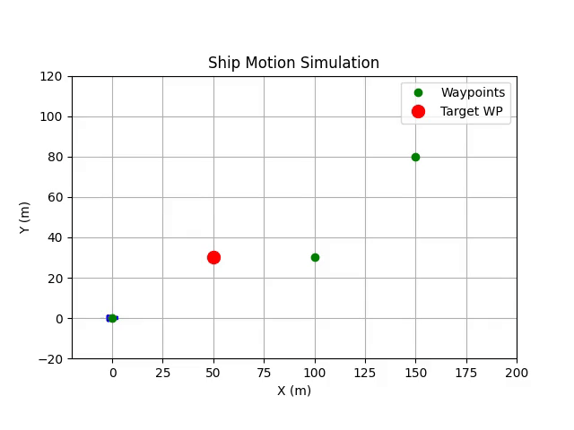

# Ship motion simulation

Simulates the planar motion of a simplified surface ship using a 3 Degrees of Freedom (3-DOF) dynamic model, modeling movement in:

- Surge (forward/backward motion),
- Sway (side-to-side motion),
- Yaw (rotation around the vertical axis).

The ship responds to control inputs from a PID, tracking predefined waypoints using a line-of-sight (LOS) guidance system. Wind disturbances are optionally modeled as external forces and moments acting on the vessel.

